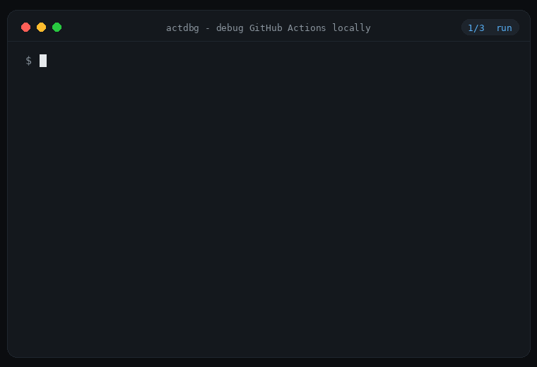

<div align="center">

# actdbg

**A debugger for GitHub Actions. Locally.**

[](https://github.com/Socialpranker/actdbg/actions/workflows/ci.yml)
[](https://github.com/Socialpranker/actdbg/releases)
[](LICENSE)

Your workflow fails → actdbg stops at the failed step → you get a shell
**inside the job container, with the step's environment** → you poke around,
fix, re-run. No more `git commit -m "fix ci" ×18`.



```bash
go install github.com/Socialpranker/actdbg@latest
```

`ui` · `run` · `shell` · `replay` · `back` · `rerun` · `diff` · `check` · `doctor` · `clean`

</div>

---

## Why

Debugging CI by pushing commits is the loop everyone hates: edit → push → wait
→ scroll logs → repeat. [act](https://github.com/nektos/act) (70k★) runs
workflows locally but gives you no debugger: when a step dies you get logs,
not a shell — `--shell` has been [requested since 2023](https://github.com/nektos/act/issues/2090)
and people resort to socat reverse shells. CircleCI's "rerun with SSH" is the
most-loved feature of that platform; GitHub Actions has nothing like it, and
[action-tmate](https://github.com/mxschmitt/action-tmate) still needs a push
per attempt.

actdbg is that missing debugger, built on act as a library:

```
$ actdbg run
ⓘ fidelity: 3 thing(s) here behave differently than on GitHub — details: actdbg check
▶ [test] actions/checkout@v4
✅ [test] actions/checkout@v4
▶ [test] Build
❌ [test] Build

⏸  stopped: step 2/5 "Build" failed (job test)
   │ compiling...
   │ error: pnpm: command not found
   container kept alive: act-ci-test-...

drop into a shell at the failed step? [Y/n]
```

The shell opens **in the job container, at the workspace, with the step's env
reconstructed** — workflow/job/step `env:` chain plus everything earlier steps
wrote to `$GITHUB_ENV` and `$GITHUB_PATH`. `$GITHUB_ENV` keeps working inside
the debug shell.

## Install

```bash
go install github.com/Socialpranker/actdbg@latest
```

Requires Docker (the same requirement act has).

## Commands

| command | what it does |
|---|---|
| `actdbg ui` | lazygit-style TUI: steps left, live log right, command log below (also: bare `actdbg` in a terminal) |
| `actdbg run` | run the workflow; stop at the first failed step; offer a shell |
| `actdbg shell` | re-enter the last failed step's container later |
| `actdbg check` | **fidelity report**: where a local run is known to differ from GitHub — per *your* workflow, with line numbers |
| `actdbg doctor` | diagnose Docker/images/arch against the most common act pitfalls |
| `actdbg clean` | remove `act-*` containers and networks left behind |

Useful flags: `-j job` · `-e event` · `-W file` · `--secrets-file .secrets` ·
`-s KEY=VAL` · `-P platform=image` · `--matrix key=val` · `--arch linux/amd64` ·
`--no-shell` · `--show-commands` · `--verbose`.

## TUI (v0.4, experimental)

`actdbg ui` — or just `actdbg` in a terminal — opens a lazygit-style
interface: jobs and steps on the left with live `▶ ✅ ❌ ⏭` statuses, the
selected step's log streaming on the right, and the last docker commands
actdbg executed at the bottom. `r` runs the workflow (a picker appears first
when a job has `strategy.matrix`), `s` drops you into the failed step's
container, `c` / `d` show the fidelity and doctor reports, `?` lists the keys.
It's experimental: layout quirks are likely; screenshot once it earns one.

**Command log.** Borrowed from lazygit's best idea: actdbg never hides what
it does to your machine. Every docker command it executes is appended to
`~/.actdbg/commands.log`, mirrored live in the TUI's bottom panel, and
printed by `actdbg run --show-commands`.

## Honesty (read this once)

**A green local run does not guarantee a green run on GitHub.** Local
emulation is an approximation by construction — different images, no OIDC, no
real `GITHUB_TOKEN`, different caches. actdbg doesn't pretend otherwise:

- `actdbg check` lists the known divergences *in your workflow* before you
  waste an evening on one (`permissions` ignored, OIDC actions can't work,
  `actions/cache` semantics differ, windows/macos jobs can't run, …). Rules are
  sourced from act's own not-supported list and its highest-traffic issues.
- The reconstructed shell env is best-effort and says so: values with
  unevaluated `${{ }}` are flagged, and the banner tells you how much was
  reconstructed from where.
- actdbg is a debugger, not a CI replacement.

## How it works

act is imported as a Go library (the same way Gitea's runner and dagu embed
it). actdbg adds: a step timeline with failure detection, `ReuseContainers`
so the failed job container survives, env reconstruction (workflow YAML chain
+ `$GITHUB_ENV`/`$GITHUB_PATH` deltas read from the container), and a saved
state so `actdbg shell` works any time later.

**Time-travel (v0.2).** With snapshots on (default), actdbg `docker commit`s
the job container after every step. That unlocks:

- `actdbg back 3` — a fresh container with the exact state *right after step
  3*, env included. `--cmd 'ls dist/'` for one-off inspection.
- `actdbg rerun --from 5` — fix the workflow, then re-run **from the failed
  step** in seconds instead of re-running the whole job. It replays `run:`
  steps and skips `uses:` actions (their effect isn't reapplied), telling you
  exactly which were skipped — so fixing a later step no longer dead-ends on
  the first `actions/checkout`.
- `actdbg diff` — step x-ray: which files each step created/changed/deleted
  and what it appended to `$GITHUB_ENV`, with timings.

Snapshots cost disk while you debug; `actdbg clean` removes all of it.
`--no-snapshot` turns the whole thing off.

**Replay (v0.3).** CI is red? Paste the run URL from inside a clone of the repo:

```
actdbg replay https://github.com/you/repo/actions/runs/123456
```

actdbg asks the GitHub API what failed (job, step, event, commit), checks your
checkout matches the run's commit (or `--here` to override), and re-runs that
job locally — the debugger takes over at the failure: shell, `back`, `rerun`.
Private repos: set `GITHUB_TOKEN`. Honest limits: GitHub-side secrets and OIDC
don't exist locally, so steps that need them fail differently — `actdbg check`
tells you which ones before you chase a ghost.

## License

MIT. Not affiliated with nektos/act or GitHub.
